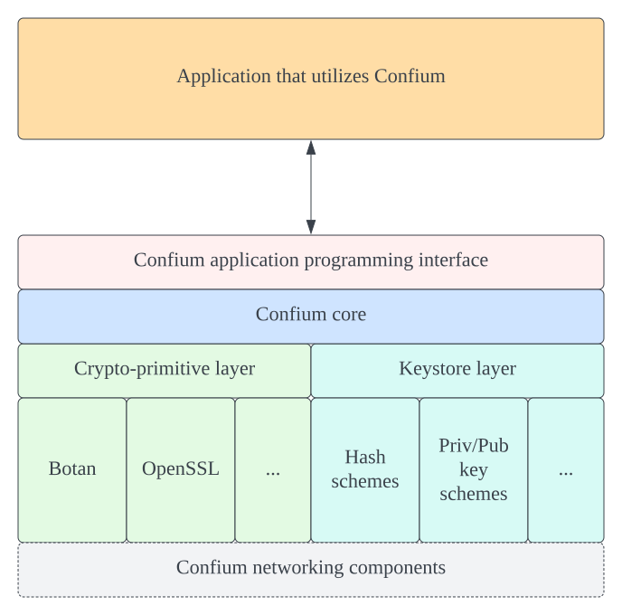
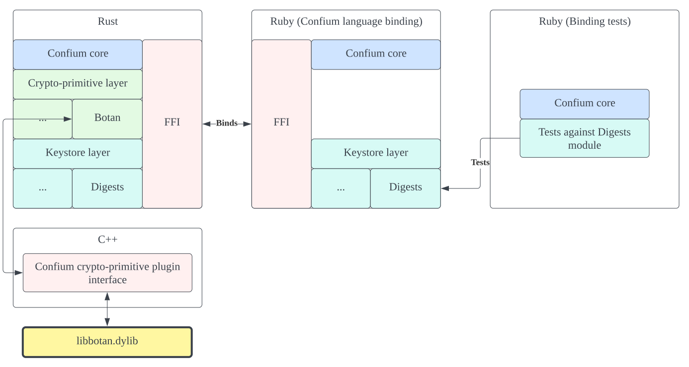
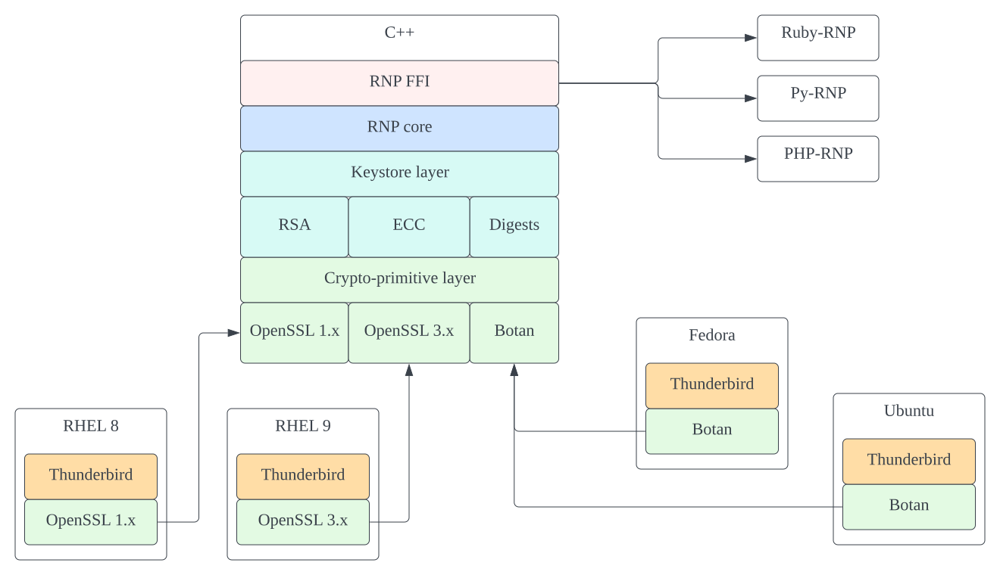

= Technical Report: Implementation of RNP Confium trust store
RNP Confium Team
2022-09-30

== Introduction

Confium is an open-source trust store framework that is a component
of https://github.com/rnpgp/rnp[RNP], an openly-licensed high performance
OpenPGP toolkit.

RNP is the OpenPGP library that powers Mozilla Thunderbird, which is deployed to
over 35+ million user instances.

Typically, using new cryptographic families with existing technologies is an
immense challenge, requiring code change in the application and in the
cryptographic library. This challenge extends from the use of cryptographic
algorithms, the storage of secrets, to newly created mechanisms such as the
networked cryptographic modes used in threshold cryptography.

Confium aims to provide a generalized API and an extensible architecture for the
usage of trust stores and future cryptographic families, to support
standardization efforts of threshold cryptography, and to bridge cryptographers
with the practical usage of cryptography.

RNP was created by Ribose and has received funding support from the Mozilla Open
Source Support fund and NLNet.

The Confium software is now provided as open source at GitHub:

* https://github.com/confium/confium

== Contributors

Implementation team members include:

* Daniel Wyatt, Ribose
* Nickolay Olshevsky, Ribose
* Maxim Samsonov, Ribose
* Ronald Tse, Ribose

== Deliverables

Phase 1:: Confium cryptographic primitive layer implementation (see <<confium-impl>>)

Phase 2 and Phase 3:: RNP cryptographic mapping and keystore layer implementation (see <<rnp-impl>>)

NOTE: The original Phase 2 and Phase 3 scopes have been amended to support
implementation of the cryptographic mapping and keystore layers in RNP, instead
as originally planned within RNP Confium due to urgent community needs.

[[confium-impl]]
== Confium core architecture implementation

=== General

The RNP Confium library has been developed and now open sourced at
the https://github.com/confium/confium[Confium GitHub repository].

For those who wish to adopt Confium, please refer to documentation of the
Confium library, at:

* https://github.com/confium/confium

=== Goals

The design goals of Confium include:

1. Provide an extensible architecture to support usage of new cryptographic
families. This includes providing "cryptographic provider plugins" to bridge
existing cryptographic libraries, and "cryptographic storage plugins" to support
different types of keys and parameters.

2. Allow decoupling of dependencies between cryptographic design,
implementation, distribution and adoption (at the control of the user).

3. Platform-independent, interoperable key storage for better confidentiality
and integrity. This also allows better ease of use, backup and restore
capabilities.

4. Utilizes a standardized and accessible key storage format to facilitate
interoperability and data portability.

5. Secure storage of secrets with compartmentalized internal security.

6. User applications can control extension activity. For example, using a secret
key stored on a locally available, single smartcard device should be possible,
even if a cloud key storage module is disabled.

7. Performance and able to serve multiple applications at once.

8. Cross-platform on major operating systems.

=== Implementation details

==== General

Confium core is implemented as a Rust application located at
https://github.com/confium/confium.

The Confium implementation is still at an early stage but already demonstrates
interactions of most its architectural elements.

In addition, the implementation also demonstrates interfacing and interactions
between multiple languages: Rust, C++ and Ruby. (See below for details.)

Rust was chosen as the development language due to its flexibility,
predictable security stance, its ability to easily operate on multiple
platforms and the ease of integrating with other languages.

==== Architecture

.General architecture of RNP Confium

There are several components in RNP Confium:

* Confium core: core code that orchestrates key usage and storage operations;

* Crypto-primitive layer: Confium plugins that interfaces with cryptographic
primitive libraries, such as Botan and OpenSSL;

* Keystore layer: Confium plugins that implement key storage facilities for
various cryptographic primitive types;

* Confium application programming interface: API for applications to directly
use Confium;

* Application: the user application of cryptographic operations provided by
Confium;

* Networking components: mechanisms that interact with networks or other Confium
instances for cryptographic operations that require remote communication.

==== Core

The Confium core is implemented using Rust under
https://github.com/confium/confium/tree/main/confium.

The crypto-primitive layer is also implemented under the same directory as above.

==== Botan crypto-primitive plugin

The Confium crypto-primitive plugin for Botan has been implemented using the C++
language (C++17).

The usage of a different language demonstrates that the crypto-primitive
plugins can be implemented by third-parties, using different languages.

The implementation is provided under
https://github.com/confium/confium/tree/main/plugins/hash-botan .

NOTE: Currently, only hashes / digests are supported by the Botan
crypto-primitive plugin.

==== Ruby language bindings

The Ruby language bindings for Confium has been implemented under
https://github.com/confium/confium-ruby.

The Confium Ruby gem ("confium") allows usage of Confium functions directly
from the Ruby language, making Confium useable not only from Rust but also Ruby.

Similar language bindings can be created for other statically-compiled
or interpreted languages, such as Python, Java and C/C++.

The Ruby bindings utilize FFI for linking with Confium core.

NOTE: Usage of the Ruby binding depends on the installation/availability of
Confium core and its crypto-primitive plugins.

=== Testing details

A test suite has been implemented through the
https://github.com/confium/confium/tree/main/confium-ruby[Confium Ruby language bindings],
at:

* https://github.com/confium/confium/tree/main/confium-ruby/specs

The test suite is implemented to demonstrate usage the full Confium architecture.

.RNP Confium test suite architecture

Tests are executed as follows:

. Individual tests are implemented in Ruby's RSpec against Confium Ruby
. The tests exercise functionality through the Ruby-Rust FFI interface
. Confium core fulfills the request through the Confium Botan plugin,
which is bound through its C++ interface
. Confium's Botan plugin interacts with `libbotan` (`libbotan.dylib` on macOS,
  `libbotan.so` on Linux, `libbotan.DLL` on Windows)
. The corresponding functions of the Botan library are executed.

Notice that these integrated tests traverse the multiple computing language
interfaces, from Ruby to Rust to C++.

NOTE: The test suite only tests against certain digest formats, additional tests
can be added with minimal effort.

Please refer to https://github.com/confium/confium/ for details on how to run
tests.

[[confium-summary]]
=== Summary

The full architecture of Confium has been implemented, which supports
functionality across multiple language programming interfaces.

A test suite that demonstrates Confium multi-language interoperability has been
developed.

[[rnp-impl]]
== Implementation of RNP cryptographic mapping and keystore layers

=== Background and goals

Instead of implementing the unified keystore layer in Confium, the RNP Confium
team has instead tackled the implementation of the cryptographic mapping and
keystore layers in RNP.

This work was performed due to an urgent community need of using OpenPGP within
the Red Hat Enterprise Linux ecosystems, including the RHEL 8, RHEL 9 and Fedora
distributions.

This work also provides guiding experience for the team in implementing the
Confium unified keystore layer.

https://www.rnpgp.org[RNP] is a high-performance OpenPGP library implemented in
C++. RNP originally only utilized the https://botan.randombit.net[Botan]
cryptographic library due to its lightweight API, timely inclusion of recent
cryptographic algorithms and rapid releases. RNP, with its dependent libraries
like Botan, are bundled within Mozilla Thunderbird in a single package
distribution.

However, https://www.redhat.com[Red Hat] has a cryptographic policy that does
not support Botan due to the resources and effort required to maintain an
additional cryptographic library in their
https://access.redhat.com/articles/2918071[RHEL certification processes] for
FIPS 140-2 and Common Criteria (ISO/IEC 15408).

This policy caused the Red Hat RHEL packagers to remove Botan from the official
Thunderbird package, which as a result rendered OpenPGP functionality unusable
in RHEL's Thunderbird.

These bugs were reported to Red Hat since 2020 December:

* https://bugzilla.redhat.com/show_bug.cgi?id=1898440[Red Hat Bugzilla #1898440: "[RHEL 7\] Unable to import OpenGPG keys"]

* https://bugzilla.redhat.com/show_bug.cgi?id=1886962[Red Hat Bugzilla #1886962: "[RHEL 7\] Thunderbird OpenGPG integration fails"]

* https://bugzilla.redhat.com/show_bug.cgi?id=1886958[Red Hat Bugzilla #1886958: "[RHEL 8\] Thunderbird OpenGPG integration fails"]

* https://bugzilla.redhat.com/show_bug.cgi?id=2133263[Red Hat Bugzilla #2133263: "[RHEL 9\] Thunderbird OpenGPG integration fails [NEEDINFO\]]

Most recently, Red Hat published a knowledge base article that provided
clarification to as why RNP was unavailable in Thunderbird:

* https://access.redhat.com/solutions/6980050[Red Hat Customer Portal: Thunderbird E-Mail experiences integration failure with OpenGPG]
(Marked "SOLUTION IN PROGRESS" as of October 19 2022)

The knowledge base article solicited criticisms from users affected by this
problem, such as the following:

[quote]
____
"That is not a solution, that is an escape from responsibility."
____

NOTE: The Fedora distributions do not have this issue, as the cryptographic
library Botan is packaged within the Thunderbird package.

The RNP Confium team decided that this issue severely affects the security
needs of our users, and is therefore more urgent than developing the keystore
layer. While the RHEL ecosystem does not represent a huge installation base,
it is a critical subset of existing Thunderbird users that heavily rely on
security and privacy for communication. We have taken a policy to fully support
those users.

We believe that handling these enhancements as Phase 2 and Phase 3 of the
approved NLNet project is consistent with its intention to protect those with a
strong need of security and privacy.

=== RNP cryptographic mapping and keystore layers

For this purpose, RNP needed to generalize its cryptographic usage to support
multiple cryptographic libraries to utilize existing cryptographic libraries
provided by RHEL distributions.

After discussions with the RHEL cryptography team and the OpenSSL development
team, the RNP team decided to target OpenSSL 3.0 for RHEL 9 as its highest
priority, and subsequently OpenSSL 1.1.1 for RHEL 8 compatibility.

The RNP team has developed a cryptographic mapping layer in C++ that allows RNP
to utilize different cryptographic libraries via the same codebase.

Cryptographic primitives such as keys and hashes from the cryptographic keystore
layer are mapped into unified objects, which allows RNP to utilize the same
keystore backends to store such information (RNP supports multiple keystore
types).

The resulting architecture of the RNP crypto-primitive and keystore layers are
shown in the following figure.

.RNP crypto-primitive and keystore layer architecture

NOTE: OpenSSL 3.0 support was introduced in RNP v0.16.1, OpenSSL 1.1.1 support
was introduced in RNP v0.16.2.

NOTE: OpenSSL 1.0.x which comes with RHEL 7 is not a supported configuration
as both RHEL 7 and OpenSSL 1.0.x have been marked end-of-life with known
security issues that will not be fixed, resulting in an insecure system.

The mapping layer performs cryptographic library detection to determine whether
Botan or OpenSSL exists, and selects the corresponding backend code.

The RNP cryptographic mapping layer currently supports the following
cryptographic libraries:

* Botan
* OpenSSL 1.1.1
* OpenSSL 3.0

While the architecture is not as ideal as that of Confium, with its multiple
primitives and extensibility through a plugin architecture, this work
accomplishes two *firsts*:

* first OpenPGP suite that works in the same interoperable way across multiple
cryptographic libraries;

* first OpenPGP suite that utilizes OpenSSL.

Furthermore, the mapping layer supports dynamic version and feature detection on
OpenSSL (via the new OpenSSL 3.0 EVP API) on the system-installed OpenSSL
library, and automatically enables the supported functionality within RNP for
use.

[example]
RNP is flexible enough to support an OpenSSL vanilla installation that does not
provide IDEA, as well as the OpenSSL package that disables the RSA/SHA1
combination on RHEL 9 and CentOS 9 Stream, by only enabling features supported
by the underlying library.

=== Deliverables

RNP first incorporated OpenSSL 3.0 support in RNP version 0.16.1 for RHEL 9,
with dynamic feature support, which incorporated these PRs (only relevant ones
listed):

* https://github.com/rnpgp/rnp/pull/1550[RNP #1550: Add OpenSSL backend]
* https://github.com/rnpgp/rnp/pull/1624[RNP #1624: Add new FFI functions `rnp_backend_string()` and `rnp_backend_version()`]
* https://github.com/rnpgp/rnp/pull/1626[RNP #1626: CLI: print info about used backend]
* https://github.com/rnpgp/rnp/pull/1631[RNP #1631: Add basic secure_vector for OpenSSL backend]
* https://github.com/rnpgp/rnp/pull/1635[RNP #1635: Workaround sudo 1.9.8 issue on Cirrus FreeBSD 12.2 runner]
* https://github.com/rnpgp/rnp/pull/1637[RNP #1637: Correctly handle short EdDSA secret key within OpenSSL backend]
* https://github.com/rnpgp/rnp/pull/1640[RNP #1640: Workaround macOS CI issue related to homebrew and OpenSSL update]
* https://github.com/rnpgp/rnp/pull/1645[RNP #1645: Update cli_tests to work with OpenSSL backend]
* https://github.com/rnpgp/rnp/pull/1692[RNP #1692: Check required OpenSSL features via CMake]
* https://github.com/rnpgp/rnp/pull/1698[RNP #1698: Fix OpenSSL version detection in `rnp::backend_version()]
* https://github.com/rnpgp/rnp/pull/1734[RNP #1734: Fix broken OpenSSL CI runs and corresponding undetected errors]
* https://github.com/rnpgp/rnp/pull/1844[RNP #1844: Add FFI API and CLI options to override current time]
* https://github.com/rnpgp/rnp/pull/1855[RNP #1855: [#1612\] FFI: add option to export armored revocation]
* https://github.com/rnpgp/rnp/pull/1863[RNP #1863: [#1859\] support OpenSSL without IDEA]
* https://github.com/rnpgp/rnp/pull/1870[RNP #1870: [#1617\] Add Fedora 35, 36, CentOS 9 to CI]
* https://github.com/rnpgp/rnp/pull/1875[RNP #1875: OpenSSL backend features detection]
* https://github.com/rnpgp/rnp/pull/1882[RNP #1882: Add support for OpenSSL 3.0 backend]
* https://github.com/rnpgp/rnp/pull/1886[RNP #1886: Release v0.16.1]

Subsequently, RNP expanded support to OpenSSL 1.1.1 in 0.16.2 for RHEL 8
(only relevant ones listed):

* https://github.com/rnpgp/rnp/pull/1905[RNP #1905: CI: Do not install botan with OpenSSL backend runners]
* https://github.com/rnpgp/rnp/pull/1910[RNP #1910: Add missing "fingerprint" identifier]
* https://github.com/rnpgp/rnp/pull/1912[RNP #1912: Release v0.16.2]

The resulting packages were adopted and republished by:

* https://www.mozilla.com[Mozilla]
** https://bugzilla.mozilla.org/show_bug.cgi?id=1794157[Mozilla Bugzilla #1794157: Cannot add PGP keys to OpenPGP manager])
* https://rpms.remirepo.net[Remi's RPM repository]
** https://mobile.twitter.com/RemiRepository/status/1585628031762452481[Remi's Twitter announcement]
* https://www.redhat.com[Red Hat]
** https://bugzilla.redhat.com/show_bug.cgi?id=2138353[Red Hat Bugzilla #2138353: "Review Request: rnp - OpenPGP (RFC4880) tools [NEEDINFO\]]
** https://bugzilla.redhat.com/attachment.cgi?id=1920830[Red Hat Bugzilla Attachment #1920830: Series of patches to backport RNP v0.16.2 to Thunderbird ESR 102 by Kai Engert]

NOTE: RNP availability as an official RHEL package for RHEL 8 and RHEL 9 is
currently being reviewed.

[[rnp-summary]]
=== Summary

The resulting work achieves the following:

* allows RNP to be built, installed and run on vanilla RHEL-based systems,
including: RHEL 8, RHEL 9, Fedora 35/36+ and the latest CentOS 9 Stream (the
successor to CentOS 8);

* allows RNP to support Thunderbird users bound to the RHEL ecosystem, therefore
supporting secure and private communication of a critical subset of users who
depend on highly secure Linux systems.

Ribose is currently planning to issue a press release on this work together with
OpenSSL and Red Hat, which would include NLNet as a major sponsor of this work.

== Conclusion

The RNP Confium team has completed the following tasks as part of the NLNet
"RNP Confium" project:

* RNP Confium core with a cryptographic primitive layer (see <<confium-summary>>)

* RNP cryptographic mapping and keystore layer implementation (see <<rnp-summary>>)
